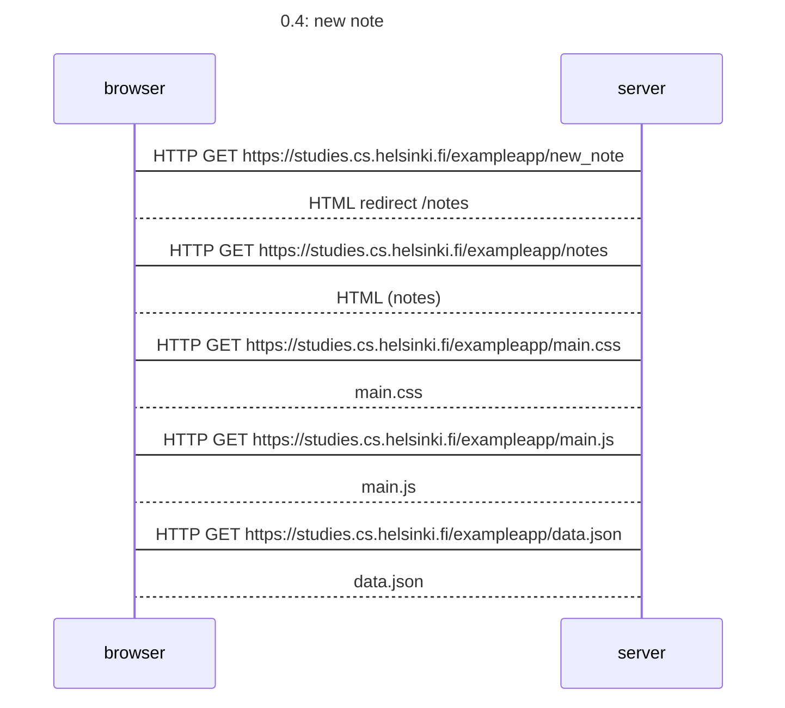

# 0.4: new note

```mermaid
sequenceDiagram
    Title: 0.4: new note


        browser->server: HTTP GET https://studies.cs.helsinki.fi/exampleapp/new_note
        server-->browser: HTML redirect /notes
        browser->server: HTTP GET https://studies.cs.helsinki.fi/exampleapp/notes
        server-->browser: HTML (notes)
        browser->server: HTTP GET https://studies.cs.helsinki.fi/exampleapp/main.css
        server-->browser: main.css
        browser->server: HTTP GET https://studies.cs.helsinki.fi/exampleapp/main.js
        server-->browser: main.js
        browser->server: HTTP GET https://studies.cs.helsinki.fi/exampleapp/data.json
        server-->browser: data.json

```
