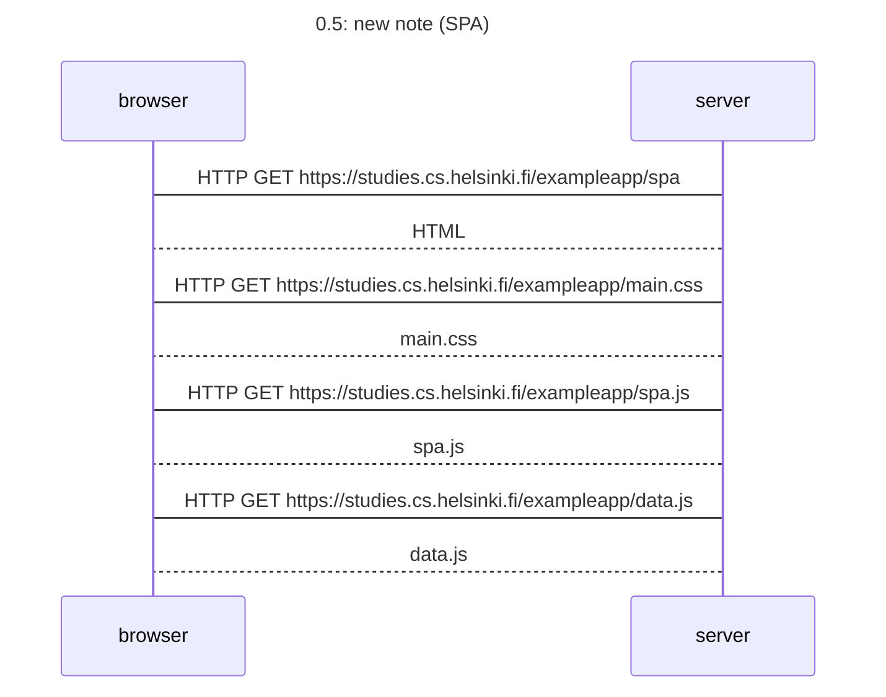

# 0.5: new note (SPA)

```mermaid
sequenceDiagram
    Title: 0.5: new note (SPA)
        
        browser->server: HTTP GET https://studies.cs.helsinki.fi/exampleapp/spa
        server-->browser: HTML
        browser->server: HTTP GET https://studies.cs.helsinki.fi/exampleapp/main.css
        server-->browser: main.css
        browser->server: HTTP GET https://studies.cs.helsinki.fi/exampleapp/spa.js
        server-->browser: spa.js
        browser->server: HTTP GET https://studies.cs.helsinki.fi/exampleapp/data.js
        server-->browser: data.js
    
```
